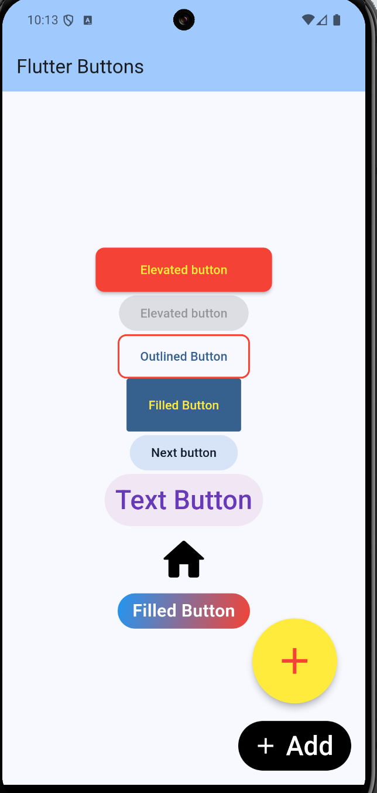

# buttons

A new Flutter project.

## Getting Started

This project is a starting point for a Flutter application.

A few resources to get you started if this is your first Flutter project:

- [Lab: Write your first Flutter app](https://docs.flutter.dev/get-started/codelab)
- [Cookbook: Useful Flutter samples](https://docs.flutter.dev/cookbook)

For help getting started with Flutter development, view the
[online documentation](https://docs.flutter.dev/), which offers tutorials,
samples, guidance on mobile development, and a full API reference.
# buttons_codingchef

Flutter에서 제공하는 9가지 주요 버튼 위젯 중 8개 학습.   
FAB / Extended FAB / Filled / Elevated / Outlined / Filled Tonal / Text / Icon Button   

<table>
  <tr>
    <th>작업 중요도</th>
    <th>버튼 위젯</th>
    <th>사용 용도</th>
  </tr>
  <tr>
    <td rowspan="3">높은 중요도의 작업</td>
    <td>Floating action button(FAB)</td>
    <td rowsapn="3">일반적으로 저장, 새파일 만들기, 완료 등 중요도가 가장 높은 인터렉션에 사용.</td>
  </tr>
  <tr>
    <td>Extended FAB</td>
  </tr>
    <tr>
    <td>Filled button</td>
  </tr>
    <tr>
    <td rowspan="3">중간 중요도의 작업</td>
    <td>Elevated button</td>
    <td rowsapn="3">카트에 담기, 답장 등 중간 단계의 중요도에 사용.</td>
  </tr>
  <tr>
    <td>Outlined button</td>
  </tr>
    <tr>
    <td>Filled tonal button</td>
  </tr>
    <tr>
    <td rowspan="3">낮은 중요도의 작업</td>
    <td>Text button</td>
    <td rowsapn="3">더보기, 좋아요 등의 낮은 중요도에 사용.</td>
  </tr>
  <tr>
    <td>Icon button</td>
  </tr>
    <tr>
    <td>Segmented button</td>
  </tr>
</table>
(코딩셰프의 플러터 맛집)

